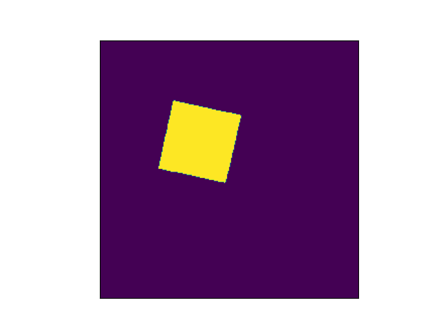

# EIT Image Reconstruction Algorithm

This repository contains the code and documentation for our submission to the [Kuopio Tomography Challenge 2023](https://www.fips.fi/KTC2023.php).

Electrical Impedance Tomography (EIT) Reconstruction Competition. In this competition, we present our approach to reconstruct high-quality images from EIT measurements.

## Table of Contents

- [Introduction](#introduction)
- [Algorithm Overview](#algorithm-overview)
- [Prerequisites](#prerequisites)
- [Getting Started](#getting-started)
- [Usage](#usage)
- [Results](#results)
- [License](#license)

## Authors

Electrical Impedance Tomography (EIT) is a powerful technique for non-invasively imaging the electrical conductivity distribution within objects. Our submission focuses on developing an innovative algorithm that enhances the quality and accuracy of EIT image reconstructions.

## Addresses

## Description of the algorithm

## Installation instructions
To run our EIT image reconstruction algorithm, you will need:

- Python 3.x
- Required Python libraries (listed in `requirements.txt`)
- Access to the provided dataset (not included in this repository)

## Usage instructions

## Examples
|   	|  Ref	| Level 1 	| Level 4 	| Level 7 	|
|----------	|-----	|---	|---	|---	|
|   **ta**	| 	| 	|   	|   	|   
|   **tb**	| 	| 	|   	|   	|
|   **tc**	| 	| 	|   	|   	|
|   **td**	| 	| 	|   	|   	|  

Scores for each sample and angle:

|   	|  Ref	| Level 1 	| Level 4 	| Level 7 	|
|-----	|---	|---	|---	|
|**ta**	|0.988	|0.963	|0.916|
|**tb** |0.933	|0.892	|0.785|
|**tc**	|0.956	|0.918|	0.830|
|**td**	|0.967	|0.960|	0.940|

{.include}
results/scores.txt

## Repository content

## License
